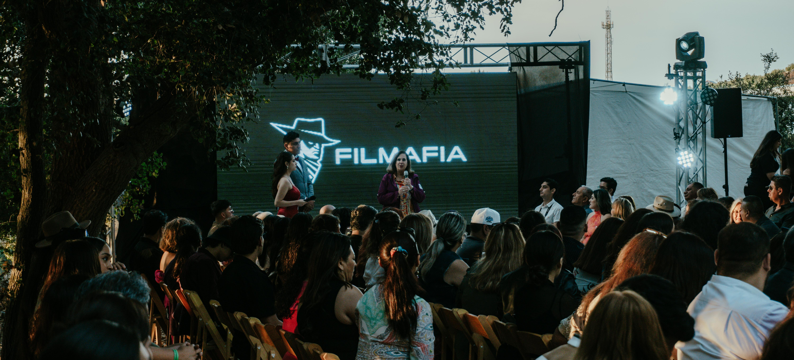

  

    
    <h1 class="text-center text-title font-weight-bold">{{ site.data.index.title }}</h1>
    
    
{{ site.data.index.para1 }}

    
 
      
    

    
{{ site.data.index.para2 }}
 
  

<blockquote>
  
  

    <ul class="text-center">{{ site.data.index.credittitle }}
      
      <li>{{ entry.linkinfo }} - <a href="{{ entry.linkaddress }}" rel="nofollow noopner noreferer">{{ entry.linktext }}</a></li>
      
    </ul>
  

  
</blockquote>

